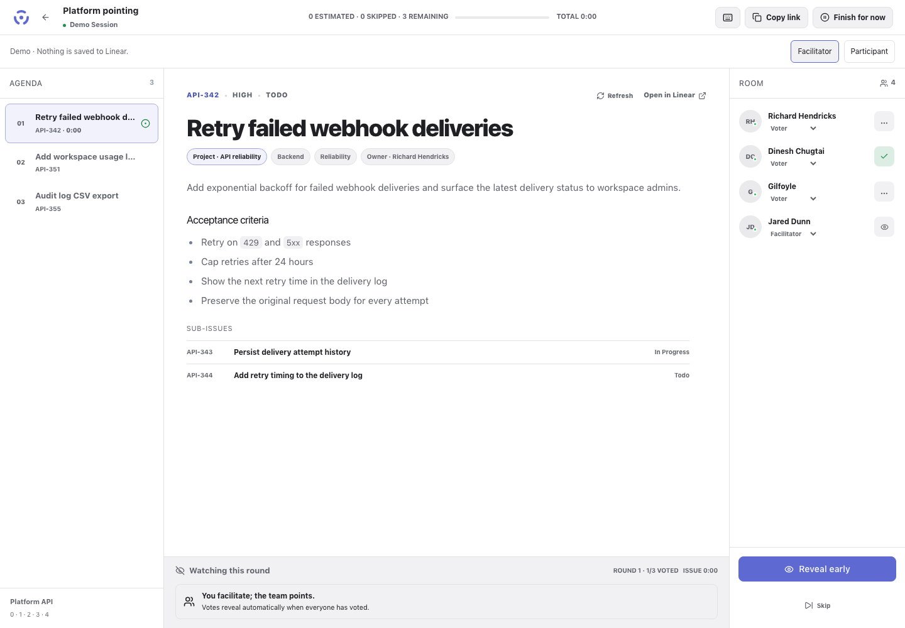

#  Pointed

[Open Pointed](https://public-linear-pointing.vercel.app) · [Try the demo](https://public-linear-pointing.vercel.app/demo) · [Help](https://public-linear-pointing.vercel.app/support) · [Privacy](https://public-linear-pointing.vercel.app/privacy)



The simple, open-source pointing poker app for Linear. A facilitator builds
an ordered issue queue, shares one persistent room link, runs private votes,
and writes the estimate back without switching tabs.

The product decisions behind the configurable workflow are documented in
[`docs/product-research.md`](docs/product-research.md).

## Point together, read independently

Prepare unestimated tickets in a Linear cycle. Load them into Pointed, adjust the agenda, and share a room link. Developers read and vote on their own screens. Reveal, discuss, and let the facilitator save the agreed estimate to Linear.

**Public beta:** real-team pilot verification is still in progress. See the [launch checklist](docs/launch/READINESS.md) for evidence and remaining limits.

## What is implemented

- public Linear OAuth with PKCE, CSRF state validation, and read-first / optional
  write scopes; there is no workspace allowlist
- encrypted OAuth tokens, server-side refresh, and opaque HTTP-only sessions
- shared per-team defaults for relative cycle, import order, reveal timing, and
  facilitator voting; personal appearance settings
- per-user Slack OAuth channel selection, encrypted webhook fallback, and confirmed
  session invitations, with copyable invites always available
- one-click import of all unestimated, unfinished issues from the current cycle,
  next cycle, two or three cycles ahead, or issues without a cycle
- drafts pinned to the resolved cycle, including after calendar rollover
- preview with Linear manual order, priority, oldest-first, drag/keyboard reorder,
  and removal without changing Linear; imports are limited to 1,000 tickets
- individual-ticket search during a session, scoped to its original intake source
- a responsive room with issue Markdown, attachments, embedded Figma designs,
  sub-issues, queue progress, roster, and phone-friendly voting controls
- independent participant browsing, mobile revealed votes, and skipped-ticket revisit
- the selected Linear team’s native scale, zero allowance, extended values,
  and T-shirt labels inherited by every new session
- secret replaceable votes, configurable automatic reveal, early reveal,
  facilitator voting, observers, absences, late joins, revotes, and issue revisit
- a pre-session waiting room, copyable Slack invite, joined-team count,
  and keyboard voting/facilitation shortcuts
- a suggested final estimate based on the arithmetic average, rounded up to the
  next valid Linear estimate card, with a facilitator override before write-back
- one secondary issue action: skip and continue to the next ticket
- total-session and per-ticket timers, pause/resume, and a copyable timed
  session summary so grooming can stop on time
- conflict detection before Linear estimate overwrite
- PostgreSQL-authoritative recovery and Pusher presence notifications that
  never contain vote values
- audit events for lifecycle, reveal, roster, revote, and Linear write-back

## Architecture

- Next.js 16 App Router + React 19 + TypeScript
- Neon Postgres + Drizzle ORM
- Pusher private presence channels
- Linear SDK / GraphQL
- Vercel deployment

Postgres is canonical. Realtime events contain only a room ID-derived channel
and a change reason; clients refetch an authorization-filtered snapshot. A
5-second polling fallback keeps the room recoverable during a Pusher outage.

## Small-team pilot

See the [pilot kit](docs/pilot/README.md) for a draft invitation, getting-started
guide, session checklist, feedback questions, and findings template. The
[current launch checklist](docs/launch/READINESS.md) separates local verification from
pending release and real Linear integration checks.

## Local setup

1. Open `/setup` and use the pre-filled Linear OAuth application form. Keep the
   distribution set to **Public** and use this callback:

   `http://localhost:3000/api/auth/linear/callback`

2. Create a Neon database and use its pooled connection string.
3. Copy `.env.example` to `.env.local` and fill the required values. Generate the token
   key with `openssl rand -base64 32`.
4. Apply migrations and start the app:

```bash
npm install
npm run db:migrate
npm run dev
```

Pusher is optional. Without it, the room uses a 5-second polling fallback. Add
the Pusher variables when you want more responsive live updates.

All Linear teams with estimates enabled appear in the team picker. Every new session
uses the selected team's exact scale. The MVP has no custom deck override;
existing rooms retain their snapshotted cards.

## Verification

```bash
npm run lint
npm run typecheck
npm test
npm run build
```

The unit suite covers pointing-scale compatibility, custom agenda sorting,
finalizable votes, rounded-average recommendations, grooming timers,
snapshotted voter reveal rules, vote secrecy, permissions, queue progression,
and OAuth PKCE/state behavior.

The cycle workflow also tests shared team defaults, access boundaries, paginated
Linear intake, pinned-cycle reloads, and failed/concurrent import recovery using
disposable PostgreSQL fixtures. Run `npm run test:ui` for isolated browser tests;
preparation/settings use synthetic fixtures and the demo never writes to Linear.
For a production-build browser pass, start the build on a separate local port and
set `UI_TEST_BASE_URL` to that origin. See the
[cycle workflow verification and rollout notes](docs/pilot/cycle-workflow/RESULTS.md).

`npm test -- src/lib/slack-persistence.test.ts` runs the actual migration chain,
Slack storage queries, and encryption in disposable, disk-backed PGlite databases.
It requires no database URL, Docker, or credentials and deletes its temporary data.
Slack HTTP responses are mocked. This verifies embedded PostgreSQL behavior;
it does not verify Neon transport, multi-connection locking, or live Slack delivery.

## Deployment

Import the repository into Vercel, provision Neon, and add the variables from
`.env.example` to Production and Preview. Set:

- `APP_URL` to the production origin
- `LINEAR_REDIRECT_URI` to
  `https://<production-origin>/api/auth/linear/callback`

Then run `npm run db:migrate` against the production Neon connection before
first use. Never expose `PUSHER_SECRET`, `TOKEN_ENCRYPTION_KEY`, or
`DATABASE_URL` as `NEXT_PUBLIC_*`.

## License

Licensed under the [MIT License](LICENSE).

## Security model

- All mutating endpoints enforce an authenticated same-origin request.
- Every room snapshot requires persisted membership.
- Every participant is checked against the room's Linear team when joining.
- The server refetches selected issues; queue metadata is never trusted from the
  browser.
- Unrevealed vote values are removed from snapshots and never enter Pusher.
- The final vote insert and automatic reveal share a row-locked transaction.
- Estimate finalization row-locks the round, refetches Linear, performs an
  idempotent update, records the outcome, and advances the queue.
- Linear Markdown is sanitized. Authenticated Linear images are fetched by a
  restricted server proxy, so OAuth tokens never reach the browser.

## Slack and settings

See [Slack setup and MVP settings](docs/slack-setup.md) for the one-time OAuth
app configuration, per-facilitator webhook fallback, migration, and verification
checklist. OAuth is optional; copying invitations always remains available.

### Automated UI checks

Run `npm run test:ui` for the demo's browser and accessibility suite at desktop,
tablet, and phone sizes. Install Chromium first with `npx playwright install chromium`.
Use `npm run test:ui:report` to review results, screenshots, and failure traces.
See [UI test results and coverage](docs/pilot/ui-ux-test-results.md) for scope,
production-build instructions, and limitations.

## Contributing and security

See [CONTRIBUTING.md](CONTRIBUTING.md), [SECURITY.md](SECURITY.md), and [release notes](CHANGELOG.md).

## Error reporting and feedback

The hosted app uses Sentry for privacy-filtered errors and optional user feedback.
Replay and screenshots are disabled. Self-hosted installs can opt in using the
variables in `.env.example`; see [Sentry setup and data boundaries](docs/launch/SENTRY.md).
