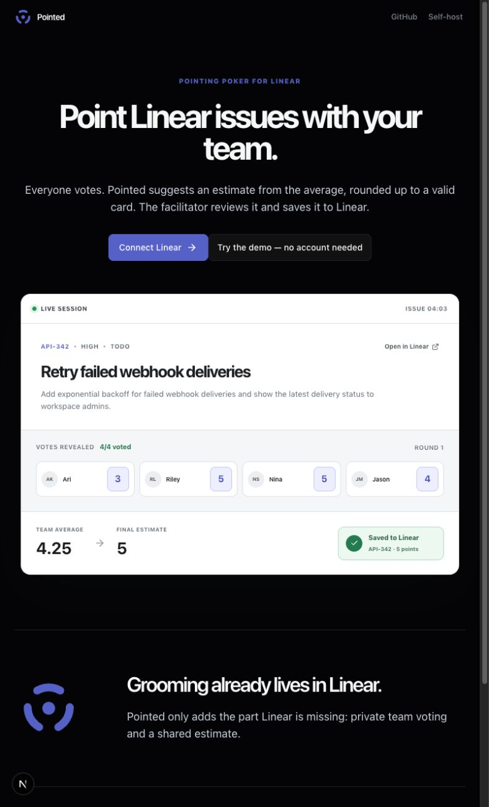
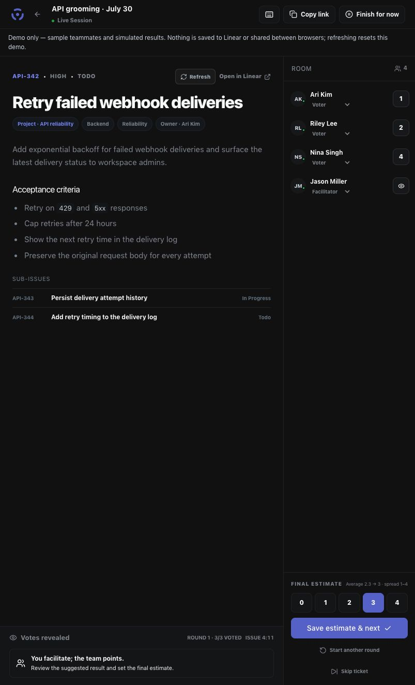
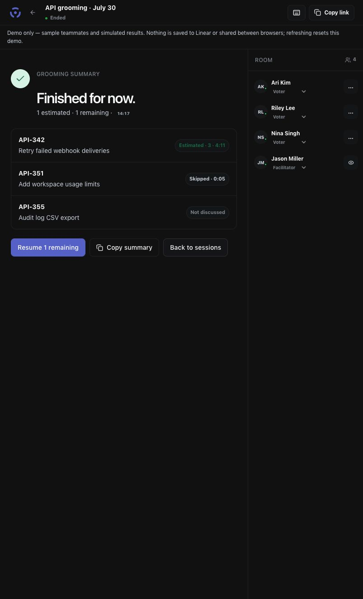
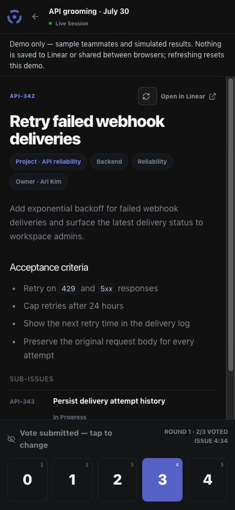
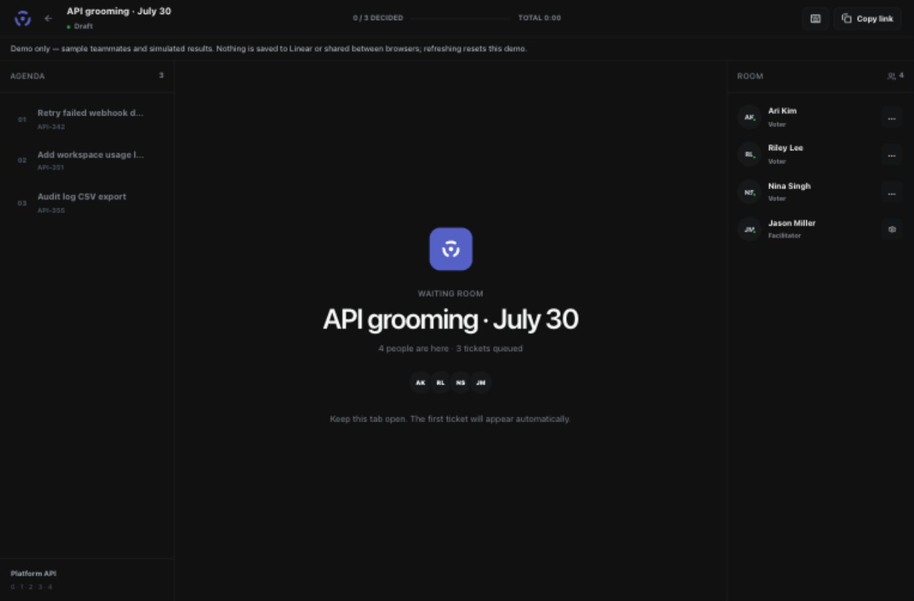
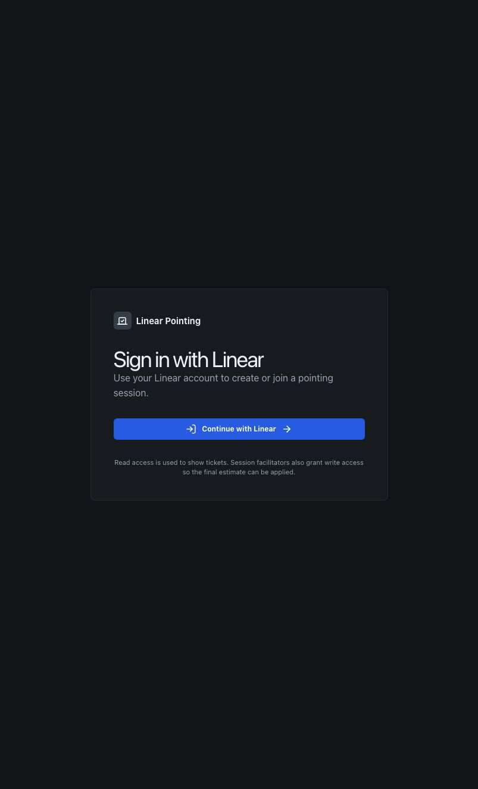
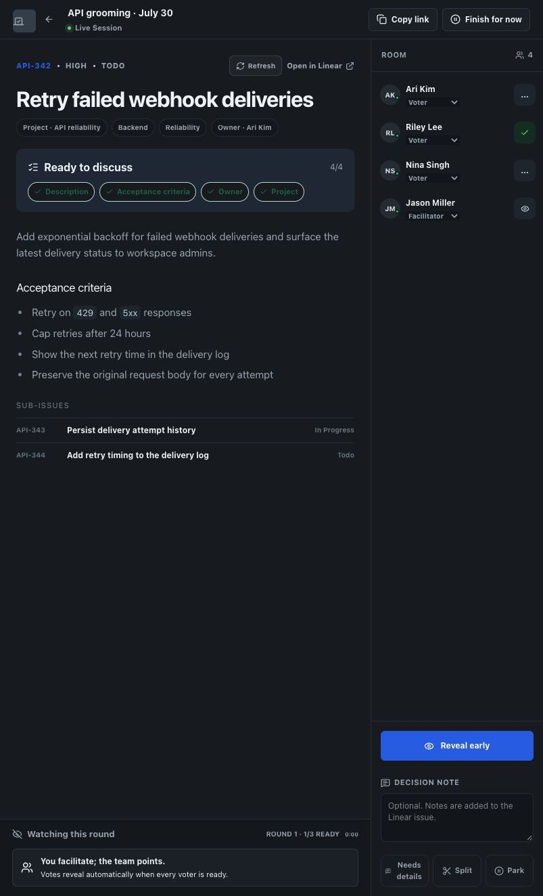
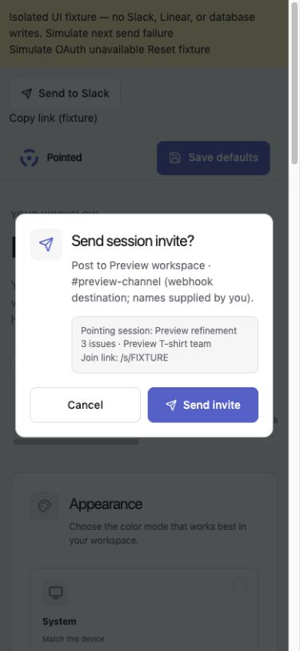

# Pilot readiness review

> Historical evidence. For current release status, see [launch readiness](../launch/READINESS.md). Later fixes and deployments supersede the status statements below.

Reviewed 2026-09-24 (America/Chicago). Repository: `jcb79107/linear-pointing`; branch `codex/pm-grooming-workflow`; base commit `e6209c6bbf91a46e6be6e6aeb54dccf5a9246ba4`, plus uncommitted pilot changes. Existing `.agents/` and `skills-lock.json` were left untouched. No production deployment, Linear changes, outreach, shared-database migration, or analytics installation occurred. The continuation adds one development-only embedded PostgreSQL test dependency and applies migrations only to disposable local test data.

**Assessment: outreach draft prepared; hold real sessions until the gates below are closed. Outreach still requires authorization.** Demo checks support a facilitated trial, not a claim that OAuth, persistence, realtime, or write-back works end to end.

The first-visit landing, sample labeling, invite permissions/vote explanation, OAuth return-to-invite recovery, sign-in discovery links, and app-owned invalid-link page were improved locally on 2026-09-24. See [first-visit evidence](verification.md#first-visit-and-invited-teammates). These changes do not alter the external release gates below; the public alias is still unconfirmed and local work is not live.

## Slack/settings update (same review session)

The local public-app checkout now has per-user/workspace Slack OAuth and encrypted webhook fallback, confirmed sends, and copy fallback. New sessions always inherit Linear’s exact team deck; deck overrides and custom sort editing have been removed. See [setup and verification](../slack-setup.md) for current behavior, setup instructions, and limits. These changes supersede references below to custom deck selection and the old upcoming-cycle default.

Additional release prerequisite: configure the Slack OAuth app/client credentials and apply the generated additive migration before deploying. Neither was done here. Live OAuth, real Slack delivery, and hosted migration execution remain unverified. The complete SQL migration chain and production Slack persistence code now pass disposable embedded PostgreSQL tests, including preservation of existing settings and room decks. UI checks use isolated fixtures and external HTTP remains mocked.

## Remaining gates

1. **Release mismatch — confirmed.** The public root redirects to sign-in and is branded Linear Pointing. Its demo offers decision notes and Needs details/Split/Park. This checkout is branded Pointed, has a landing page, and uses Skip ticket / Save estimate & next. GitHub records production deployment `5988903696` at `860c7654ebd2c0071e2e0dbc5ef041a511f58420` and a later preview at the local base, but the current public alias mapping remains unconfirmed. Vercel access was unavailable; see the verification report. Owner: Jason. Select and record the intended pilot revision, deploy through the existing process when authorized, and recheck the actual URL against the guide. The local fixes are not live.
2. **Real integration proof — pending by explicit demo-only instruction.** Owner: Jason with the first facilitator. Before a real session, authorize a disposable team/issue and test two distinct Linear accounts: read sign-in; facilitator write upgrade; agenda import; invite return after OAuth; unauthorized/wrong-team denial; both voters joining; hidden votes; reveal; agreed estimate save; matching value in Linear; refresh recovery and summary. Also test conflict cancellation and failure/retry handling safely. Do not modify actual work issues just to satisfy this gate. Record deployed SHA, issue authorization, expected/observed values, and pass/fail. No credentials need to be put in this repository.

These are readiness gaps, not assertions of confirmed backend failure.

## First-use journey and evidence

| Step | Health | Evidence / limits |
| --- | --- | --- |
| 1. Discover | Local path improved; release mismatch | Landing now links to account-free demo and explains facilitator confirmation. Public root still redirects to sign-in. Screenshots 01/06. |
| 2. Connect Linear | Source reviewed; integration pending | `src/app/app/page.tsx`, `api/auth/linear/{start,callback}/route.ts`, `api/sessions/route.ts`: read-first OAuth and write upgrade. Return paths hardened. Consent itself was not exercised. |
| 3. Prepare agenda | Source reviewed; authenticated screen unavailable | `DashboardClient.tsx`, `QueueBuilder.tsx`, `lib/preferences.ts`: team selection and inherited scale, search/filter intake, sorting, invite, start. New-user defaults are any cycle/Todo/unestimated; existing saved filters can still hide expected tickets, and the guide supplies recovery. No fake agenda-import claim. |
| 4. Invite/join | Demo waiting room works; real joining pending | `src/app/s/[code]/page.tsx`, `JoinSession.tsx`, `lib/sessions.ts::joinPokerSession` require workspace/team access. Screenshot 05 is a fixture, not evidence of multiple users connected. Clipboard errors now show copyable links. |
| 5. Estimate | Demo passed | Screenshot 02: reveal suggests 3 from votes 1/2/4. Simulated save advances to API-351; skip advances to API-355. Screenshot 04: phone vote selected and replaced by keyboard. Real vote secrecy/realtime needs gate 2. |
| 6. Record decisions | Demo summary passed; manual reasoning notes | Finish yields estimated/skipped/not-discussed records and remaining count (03). Copy button reports success. Clipboard-denied fallback added, not forced in browser. No decision-note input in this checkout; use existing notes. |
| 7. Write results back | Implementation reviewed; external effect unverified | `lib/sessions.ts::finalizeEstimate`, `lib/linear.ts::updateLinearIssueEstimate`: scale validation, Linear conflict check, update, transactional session progress, success/failure audit events. Demo intentionally does none of these external writes. |

## Additional verification pass

See [verification report](verification.md): the 2026-09-24 continuation verifies migration/persistence locally, fixes ambiguous browser delivery recovery and false success reporting, and documents deployment metadata. Earlier checks covered disabled estimation, Slack authorization, production HTTP, and the demo journey.

## Fixed locally

- **Essential usability:** a late `.room-grid` CSS override reinstated three columns below the breakpoint that hides the agenda. Reproduced at approximately 803 px: issue content squeezed into the left column with unused space on the right. Removed the override; existing two-column rules now apply. Checked tablet, 390 px phone, and 1366 px desktop layouts.
- **Recovery:** preparation/room invite copy failures now expose a selectable URL; summary copy failure exposes a read-only textarea. Errors announce through `role="alert"`. Successful copy behavior remains intact. Browser clipboard denial was not forced; catch paths were source-reviewed.
- **Trust/discovery:** demo explains sample teammates, simulated results, no Linear writes, no cross-browser sharing, and refresh reset. Landing adds demo access and makes facilitator confirmation explicit. Existing sample names/issues were retained as demo fixtures; they are not pilot participants.
- **OAuth bug:** `safeReturnTo` previously accepted slash-backslash and newline/tab paths that URL parsing can interpret as another host. It now rejects normalized external paths while preserving local invite/preparation URLs. Seven regression cases pass.

## Can wait

- Preserve new-session name/team through first-time write consent (workaround: re-enter; documented).
- Rich decision-note workflows, additional outcome types, onboarding redesign, custom analytics, and cosmetic polish. Use current team notes and observe actual need.
- Broader accessibility review. Phone vote controls expose checked state and keyboard shortcuts were exercised, but this was not a WCAG audit. The roster is hidden on phones by existing CSS, so facilitate on desktop for the pilot.

## Verification

- Baseline: 10 test files / 36 tests passed before edits.
- Latest: lint, TypeScript, 22 test files / 103 tests, and `next build` passed. `git diff --check` passed.
- Browser: current public sign-in/demo inspected; local development and production builds inspected. Production build demo verified reveal, save-and-advance, skip, finish, summary, and phone vote replacement; desktop draft waiting room checked. Only demo routes were exercised for mutations.
- No connected integration test environment was created; Slack/settings UI was checked in an isolated local fixture with mocked APIs. No live OAuth permission was granted. No database logs queried, multi-user session run, or Linear estimate changed. Hosted persistence, real provider errors/reconnect behavior, and real permission boundaries remain unverified. Disposable embedded PostgreSQL persistence now passes; it does not validate Neon networking or multi-connection locking.
- Existing logs/audit events suffice for 2–3 sessions; the kit explains how to pair them with manual observations. There is no claimed pilot usage data.
- Recovery for these changes: revert the pilot code diff/redeploy the previously approved revision if needed; the Slack change adds a connection table; the earlier pilot fixes had no schema changes. Leave that additive table in place for rollback. A code rollback does not undo estimates a future pilot intentionally saves.

## Screenshots from this review

All images are current-run captures of existing demo fixtures or public sign-in. They contain no real pilot activity.

### 1. Local discovery

### 2. Local reveal at tablet width

### 3. Local session record

### 4. Phone voting

### 5. Desktop waiting room

### 6. Public sign-in

### 7. Public demo differs from checkout

### 8. Slack confirmation on a phone

Actual invite component in an isolated local fixture; destination and delivery are mocked. No message was sent.

