# Pointed UI and UX audit

Reviewed September 27, 2026. Assessment only; no application changes or deployment.

## Overall judgment

The core desktop pointing experience is strong. It puts the issue, private vote, team response, and facilitator decision in a sensible order. The visual identity is restrained and coherent. The next investment should be task completeness and simpler preparation, not a redesign or more features.

The biggest confirmed gap is mobile reveal: the average and final estimate remain visible, but the individual votes disappear. That removes information the team needs to discuss disagreement.

## Evidence and limits

Fresh browser inspection of the current local production build on port 3003, including landing, setup, participant voting, facilitator reveal, save-and-advance, skip, and finish. Desktop captures use 1440 × 1000; mobile uses 390 × 844.

Local authentication redirects to setup because this environment is not fully configured. Dashboard, preparation, settings, and join-error screens were rendered using the real application components with synthetic data in an isolated fixture on port 3004. Fixture screenshots carry a banner. The join error was deliberately injected; it does not demonstrate a production outage.

This is not a production release audit or a claim that every integration works. Real OAuth, Linear writes, Slack delivery, multiple-user synchronization, reconnect behavior, cross-workspace permissions, and persistence were not exercised. Sign-in/invitation copy and keyboard reorder configuration received source review. Prior automated test results are not counted as fresh evidence for this audit. No WCAG compliance claim is made.

## Journey review

### 1. Landing — strong

The headline and supporting copy explain the actual benefit: people can read tickets on their own screens. The product preview and recognizable team names make the page concrete. Connect Linear and Try the demo are clear next steps.

Improve demo continuity: offer an obvious Facilitator / Participant switch. The default demo starts as facilitator, so a first-time visitor can miss the voting experience. Keep the illustrative team and scale coherent across the landing and demo. Different real teams can legitimately use different scales.

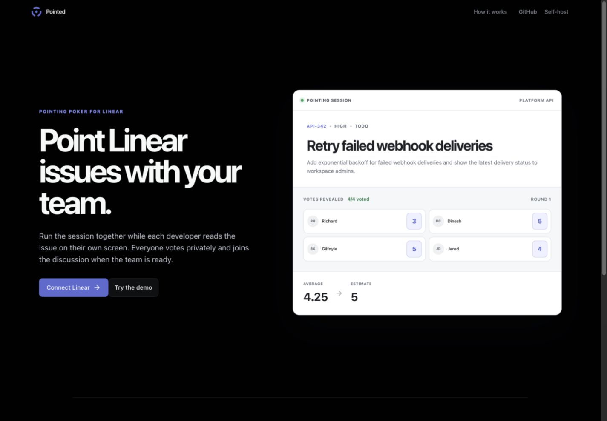

### 2. Setup and invitation — partly unverified

The self-host setup guide gives developers a useful concrete starting point. It should remain separate from hosted-team onboarding. In this local environment, Connect Linear reaches setup; that is a configuration boundary, not evidence that production is broken.

The join component has understandable loading context, a clear failure heading, Try again, and Back to sessions. Good recovery structure. Real expired-invite, wrong-workspace, and OAuth-return journeys still need an authenticated pass. Source-reviewed invitation wording says votes stay private until the facilitator reveals them, while automatic reveal is supported; make that wording match the configured rule.

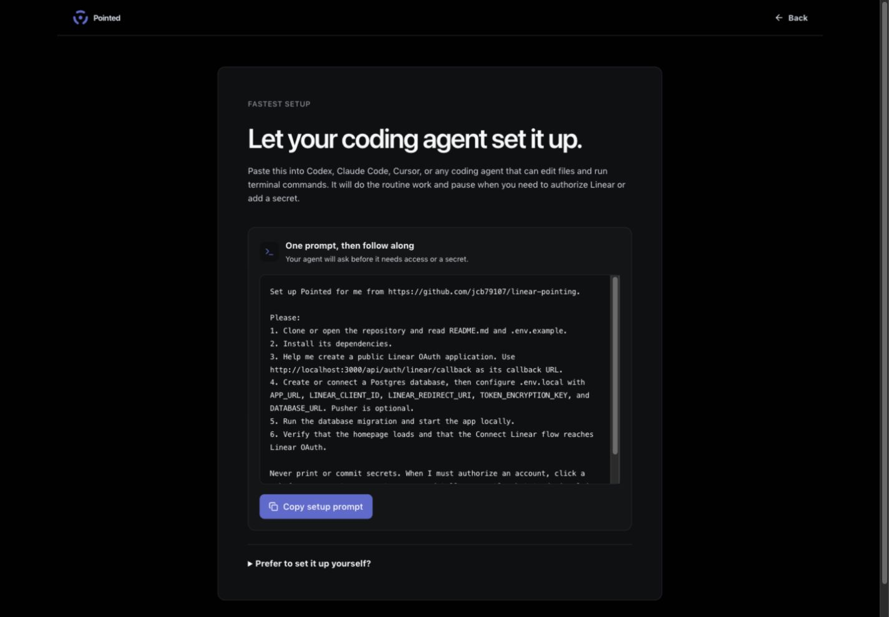
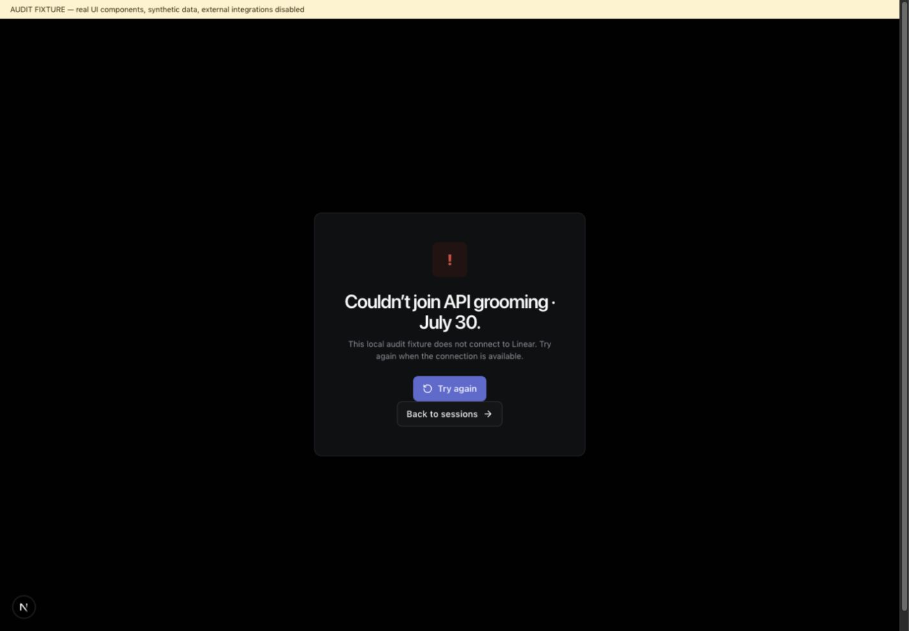

### 3. Dashboard and session creation — good foundation

The empty state makes the next action obvious. Session name and team are the right minimum inputs. Avoid adding dashboard metrics before pilot feedback demonstrates a need.

When creation opens, other create-session prompts remain visible. Consolidate them into the active form. The detailed explanation about zero, extended values, and T-shirt labels is too much at this step; show the chosen team's scale succinctly.

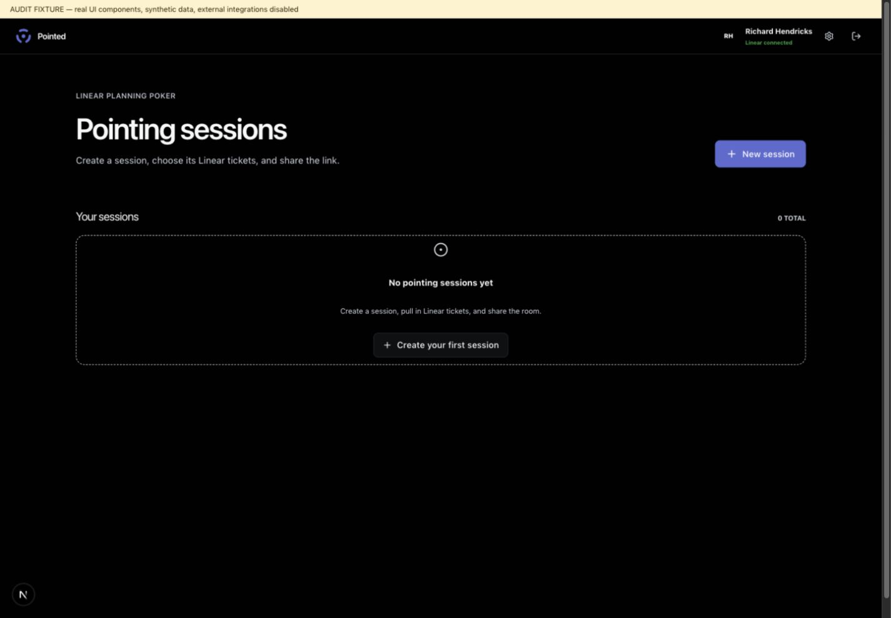
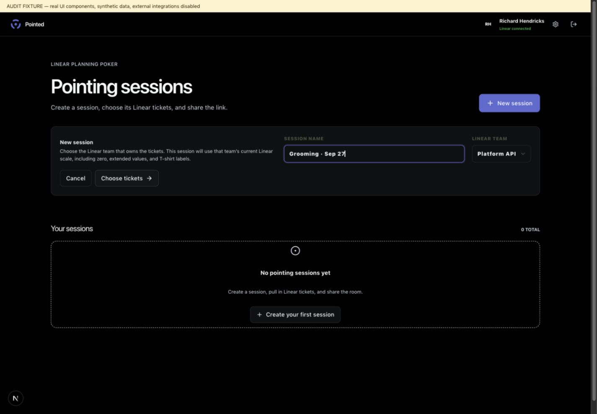

### 4. Ticket preparation — highest friction

Separating ticket intake from meeting order is a good model, and mobile Find tickets / Agenda tabs preserve it. Queue count and joined participants provide useful context.

The intake area repeats itself: Add tickets, Linear intake, Add matching tickets, Add individual tickets, Search, and Load tickets to point compete for attention. Use one filter/search area, a visible result list, and Add selected / Add all N results. Preview the count before adding a batch.

The empty-results advice says to try another title or ID even with a blank query and active filters. Show the active constraints and offer Reset filters. Rename Copy Slack invite to Copy invite link if the copied link works anywhere; keep Send to Slack as a separate convenience.

Accessibility: QueueBuilder explicitly registers only PointerSensor (lines 150–151). Add keyboard reordering or Move up/down actions. The search field relies on its placeholder and appeared unnamed in the accessibility tree; give it a persistent accessible label. These are source/AX findings, not a completed assistive-technology audit.

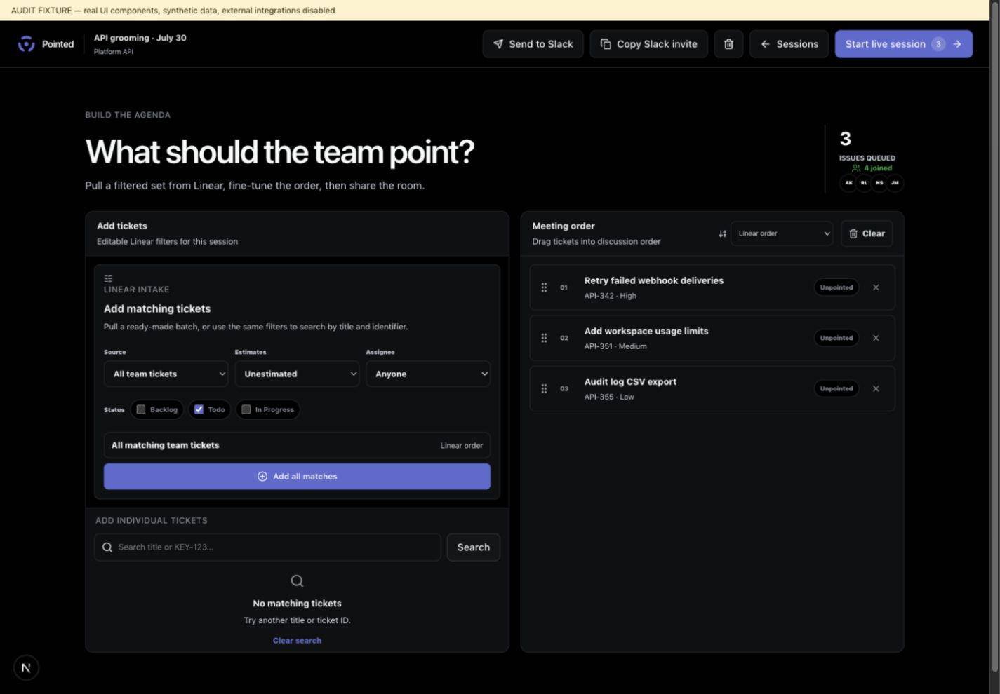
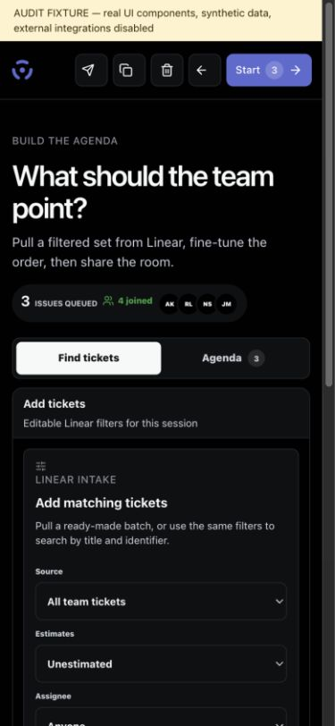

### 5. Participant voting — strongest screen

The active issue has room to breathe, including description, acceptance criteria, and sub-issues. Private voting is simple, and Vote submitted — tap to change is excellent feedback. The selected card has a programmatic pressed state. Participants can independently read the active ticket without relying on a shared screen.

The agenda does not let participants browse other tickets independently. Consider browse-ahead with a clear Return to current ticket action if that fits the intended workflow. Treat this as a product opportunity, not a failure of active-ticket reading.

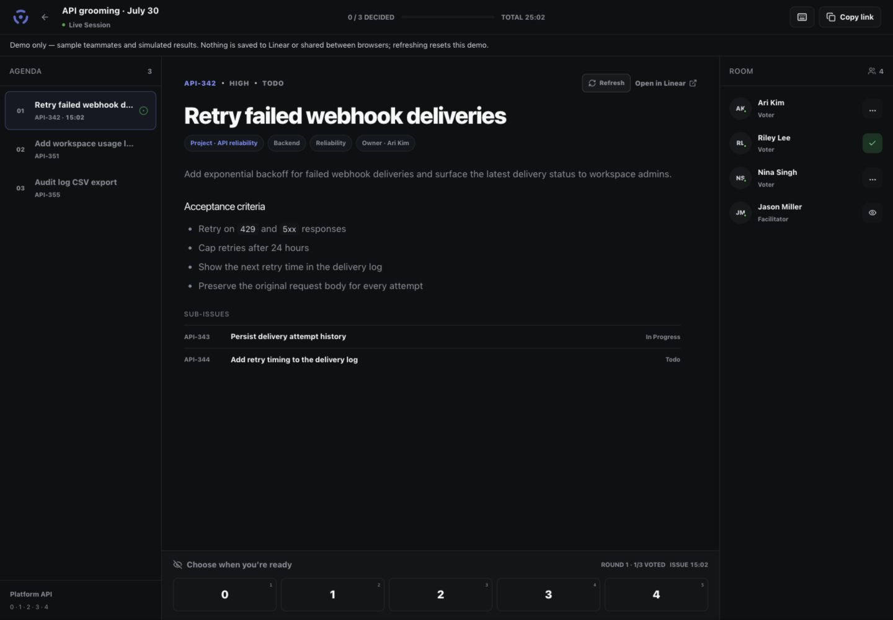

### 6. Reveal and decision — strong desktop, mobile gap

On desktop, individual votes, spread, final estimate, and Save estimate & next support a quick discussion and explicit decision. Start another round is a useful escape hatch.

On a phone, the participant list is hidden after reveal. Only the aggregate remains, so the facilitator cannot see who chose the high or low estimate. Restore a compact expandable vote list. Preserve access to the agenda as well; hiding it makes returning to skipped tickets difficult.

Make disagreement more prominent than the arithmetic average. A rounded average is a suggestion, not evidence of consensus. Keep the facilitator's explicit final decision.

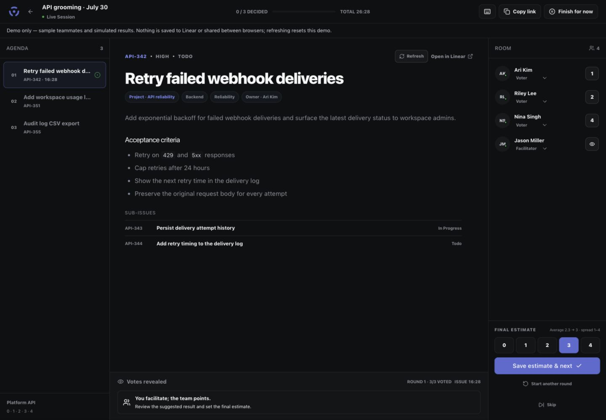
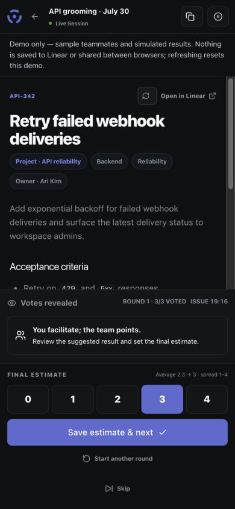

### 7. Session completion — useful, needs consistent accounting

Finished for now, Resume, Copy summary, and Back to sessions form a useful partial-completion flow. Per-ticket rows distinguish estimated, skipped, and not discussed.

The exercised session had one estimated, one skipped, and one untouched issue. The headline showed one estimated and one remaining, omitting skipped, while the header called two of three decided. Use consistent explicit counts: 1 estimated · 1 skipped · 1 remaining. Make skipped items directly revisit-able, especially on mobile. In real sessions, distinguish confirmed Linear saves from pending/failed saves; integration behavior remains unverified here.

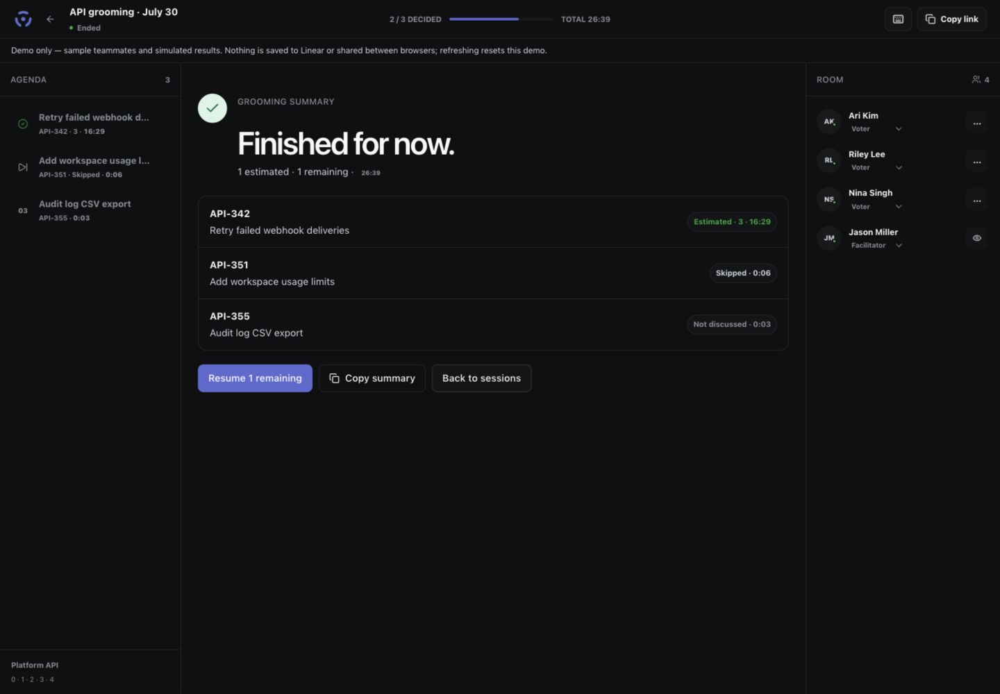

### 8. Settings — capable, hierarchy can improve

Personal versus shared defaults is clearly explained. Optional Slack integration and connection status are useful. Appearance correctly explains that it saves automatically on this device.

Put workspace connection and voting defaults ahead of appearance. In the read-only state, Connect / switch Linear workspace does not explain the immediate task; use Enable estimate saving where appropriate, with workspace switching separate. Add unsaved-change feedback for explicit Save defaults sections so users can distinguish them from automatically saved appearance preferences.

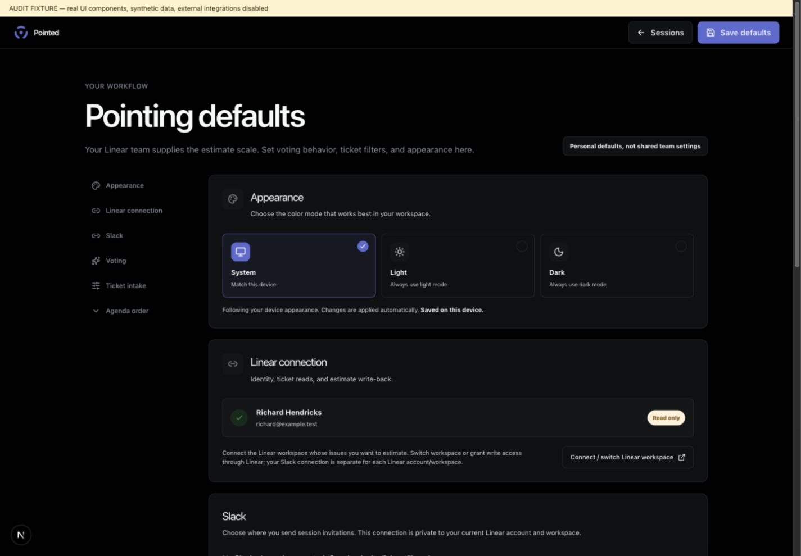
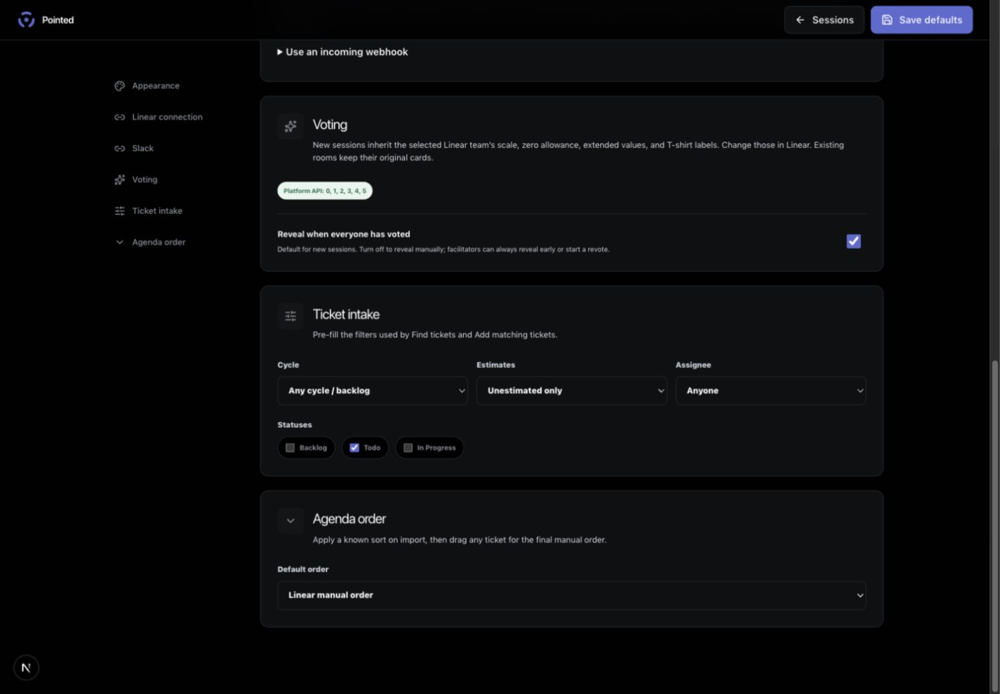

## Recommended order

1. **Before pilot: mobile task completeness.** Show individual revealed votes and provide an agenda/revisit path. Verify a facilitator can discuss a split vote and return to a skipped issue on a phone.
2. **Before pilot: accessible preparation.** Keyboard reorder and labeled search. Verify ordering without a mouse and with screen-reader output.
3. **Next: simplify ticket intake.** One search/filter/result model, visible batch counts, actionable empty states. Ask a new facilitator to assemble five tickets without coaching.
4. **Next: demo and completion clarity.** Visible role switch, consistent counts, direct skipped-item recovery, accurate reveal wording.
5. **Then: settings polish.** Task-oriented permission controls, stronger save feedback, core defaults first.

Before inviting real teams, run a separate authenticated journey with two users: invite → join → private votes → reveal → save to Linear → refresh/rejoin → finish/resume. Include a failed save and expired/wrong-workspace invitation. Those checks resolve the largest remaining evidence gaps.
