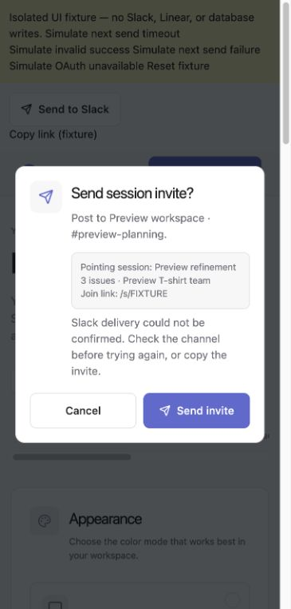
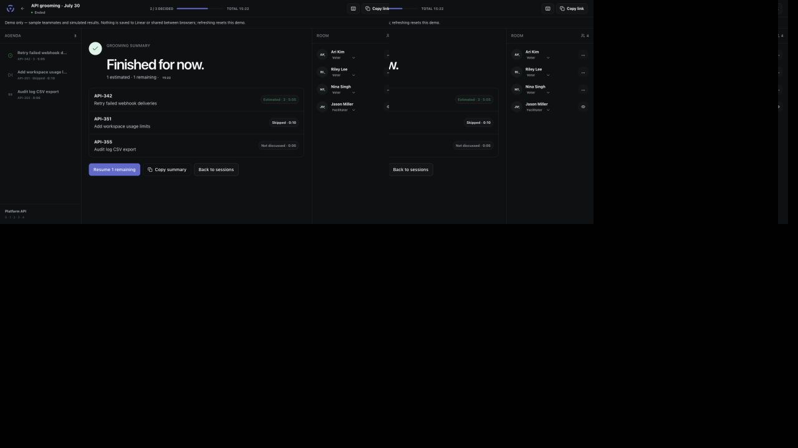

# Pilot continuation — 2026-09-24

> Historical evidence. For current release status, see [launch readiness](../launch/READINESS.md). Later fixes and deployments supersede the status statements below.

## First visit and invited teammates

Reviewed the actual entry points for a new visitor (`/` → `/app`) and a signed-out teammate (`/s/<invite>` → Linear OAuth → invite). The homepage already existed, but it lacked the team flow and access expectations, and its decorative card showed a live session and a completed Linear write even though the names, tickets, and votes were fabricated. It also linked the sample issue to the generic Linear homepage. The landing page now explains the three real steps, states that the demo is simulated, identifies the preview content as sample data, and describes the facilitator-confirmed write. The fake issue link is now a label. Visitors can reach the interactive demo without an account; “How it works” scrolls to the explanation on desktop and phones.

The invite now says that Linear sign-in checks access to the named team, that votes stay hidden until the facilitator reveals them, and that only the facilitator can save an estimate. OAuth denial or expiry returns a guest to the same invite with an actionable error so they can retry. This corrects the previous failure path that discarded the invitation and redirected to the sessions screen. Direct `/app` sign-in also links back to product information and the demo. Invalid or old links get an app-owned message and working next steps. Social metadata now states the product’s actual facilitator-controlled write behavior.

The Linear callback regression test covers canceled sign-in, expired state, and a tampered external return cookie; it confirms the return stays on the app origin. Production build and browser inspection verified the homepage at desktop and 390px phone widths, no horizontal page overflow, the visible mobile anchor, and its scroll destination. Screenshots: [desktop first visit](evidence/11-first-visit-desktop.png), [mobile first visit](evidence/12-first-visit-mobile.png), [mobile explanation](evidence/13-how-it-works-mobile.png). These use the existing sample UI; they contain no pilot activity.

Latest suite: 106 tests in 23 files, lint, TypeScript, `git diff --check`, and production build passed. A strict scan from the optional frontend design skill reported 10 existing source findings across the settings, agenda, room, and Slack forms (4 ownership decisions and 6 form/affordance rules); none pointed to the landing, invitation, callback, or not-found changes in this pass. The scan’s `actionless-button` finding is the existing sortable drag handle, which receives its event handlers from the DnD library. No unrelated application-wide UI migration was made.

Branch/base remain `codex/pm-grooming-workflow` / `e6209c6bbf91a46e6be6e6aeb54dccf5a9246ba4`, with uncommitted changes preserved. No changes to the reference checkout, `.agents/`, or `skills-lock.json`.

## Concrete recovery fix

Extracted the existing browser send request into `src/lib/slack-invite-request.ts` and reproduced five failing cases: timeout, network failure, and three malformed success responses. Previously a timeout advised retrying and an HTTP 200 with invalid/missing success data could display “Invite sent.” The request now validates the response and requires explicit success. Ambiguous delivery says to check the channel before trying again or copy the invite. Actionable server errors remain visible; there is no automatic retry. A further null-response regression also passes.

## New verification

| Boundary | Result | Evidence / limits |
| --- | --- | --- |
| Migrations and persistence | Passed on disposable embedded PostgreSQL | Six tests in `src/lib/slack-persistence.test.ts` run the actual 0000–0006 SQL using Drizzle's migration journal. Upgrade preserves seeded legacy filters, custom preferences, and existing room cards. New SQL inserts default to any cycle. Re-running the migrator does not replay applied migrations. |
| Slack storage and encryption | Passed on disposable disk-backed database | Production query/encryption code, fixture key, metadata-only reads, ciphertext decryptability after close/reopen, separate users/workspaces, stale confirmation rejection, denied foreign owner, owner foreign key, disconnect isolation, and user-delete cascade. |
| Send reservations | Passed on embedded PostgreSQL with mocked HTTP | One of four competing calls claims the row; immediate repeated calls fail; reconnect retains cooldown; expired cooldown permits a send; ambiguous delivery retains its reservation. PGlite serializes a single connection, so this is not proof of multi-connection lock contention. |
| Browser delivery contract | Seven regression cases pass | Actual request helper, fake fetch/timers: timeout, network error, malformed/null response, server error, explicit success. One fetch per attempt. |
| Browser recovery UI | Passed in isolated fixture | Actual current SlackInviteButton and ConfirmDialog. Simulated 20-second server response triggers the real 15-second browser timeout. Warning remains in the dialog; no false sent state. Narrow viewport and 1366 × 900 desktop inspected. Invalid HTTP 200, confirmed simulated success, Tab wrapping, Escape, and return focus checked. No warning/error console entries. No live provider calls. |
| Repository checks | Passed | 103 tests across 22 files, lint, TypeScript, production build, and diff whitespace check. A test-fixture parameter needed an explicit string type. Initial build hit sandbox port restrictions; clearing the failed generated Turbopack cache and rerunning with local permission passed. |

The pinned development dependency `@electric-sql/pglite@0.5.8` provides an embedded PostgreSQL engine without a service, Docker, credentials, or infrastructure. Test data is created under the OS temporary directory and removed afterward. No real database URL is used. See [PGlite documentation](https://pglite.dev/docs/) and the installed Drizzle PGlite adapter. This does **not** prove hosted Neon transport, deployed migration state, or live integration behavior.

## Deployment identity investigation

Read-only GitHub deployment records on this date identify:

- Latest recorded **Production** deployment: `5988903696`, successful on 2026-08-19, revision `860c7654ebd2c0071e2e0dbc5ef041a511f58420`, URL `https://public-linear-pointing-gc5gvye65-jcb79107s-projects.vercel.app`.
- Latest recorded **Preview** deployment: `6009661572`, successful on 2026-08-20, revision `e6209c6bbf91a46e6be6e6aeb54dccf5a9246ba4`, URL `https://public-linear-pointing-3tect1m2f-jcb79107s-projects.vercel.app`.

Sources: `gh api repos/jcb79107/linear-pointing/deployments` (including the Production filter) and each deployment's `/statuses` endpoint. These records do not establish the **current** public alias mapping: manual deployments or promotions may differ. Vercel's connected tool returned 403 for team `team_GGJ4ORC4510VKnYWNq2bVRxO` / `jcb79107s-projects`; the project dashboard required sign-in. No authentication or permission changes were made. An owner with existing access must inspect the current alias and record its deployment ID and full SHA before release.

## Still pending

The user's demo-only instruction remains in force. Slack app distribution and server credentials, an authorized target-database migration, approved deployment, live Linear OAuth/write upgrade, two-account vote secrecy/sync/recovery/write-back, and real Slack channel delivery/revocation/separate identities remain release gates. No real issues were changed, Slack messages sent, teams contacted, permissions granted, or deployment performed. No pilot activity or participants are claimed.

## Previous verification — 2026-09-23

The report below is historical; its database gap and test totals are superseded by the continuation above. Its demo and HTTP results were not unnecessarily repeated.

### Additional verification — 2026-09-23

**Story:** a facilitator inherits a Linear team’s estimate configuration, connects a private Slack destination, reviews and sends an invite, and guides a session to a useful summary.

Branch/base: `codex/pm-grooming-workflow` at `e6209c6bbf91a46e6be6e6aeb54dccf5a9246ba4`, plus the current uncommitted changes.

## Bug reproduced and fixed

When Linear estimation was `notUsed` but its zero allowance remained true, `linearTeamEstimateCards` returned a zero-only deck. The session route incorrectly returned 201. The regression failed before the fix (expected 422, received 201); it now rejects the session with a useful disabled-estimates message and never creates a room. The fix returns no cards for disabled/unknown scales before applying zero allowance.

## Evidence

| Boundary | Result | Evidence |
| --- | --- | --- |
| Build and static checks | Passed | 90 tests in 20 files; lint, TypeScript, production build, diff whitespace check. |
| Selected team → session cards | Passed with mocked Linear/storage | Exact T-shirt labels and values, zero/extended configuration, legacy override ignored, disabled team rejected. |
| Slack OAuth start/callback | Passed with mocked auth/Slack | Least-privilege scope, secure state cookies bound to identity, no forced workspace, callback mismatch/account switch/denial/error coverage. |
| Connection API → ownership | Passed with mocked storage | Owner/source spoofing ignored; only signed-in identity saved/read/deleted; invalid webhook rejected without echoing secret. |
| Actual production HTTP routes | Passed on loopback | Public root/demo 200; signed-out Slack GET/PUT/DELETE and invite POST 401; foreign-origin mutations 403; Slack OAuth start redirects to /app. Settings uses a streamed Next.js redirect to /app. |
| Browser demo → session summary | Passed | Reveal, finish unfinished session, resume, reveal again, save estimate 3, advance, skip next issue, finish, copy summary. Summary shows one estimated, one skipped, one not discussed. No browser warning/error logs recorded. |
| Slack UI → responses | Isolated fixture only | Earlier settings/confirmation/browser checks use actual components and mocked APIs; see readiness screenshots. |
| Database migration/persistence | Not exercised | No local PostgreSQL or Docker executable available; no connected database was used. SQL generation/SQL-shape tests do not prove database execution. |
| Live OAuth, Slack delivery, Linear writes, realtime | Not exercised | User’s demo-only instruction remains in effect. No external grant, message, or issue mutation. |

Production runtime checks used dummy credentials, an intentionally unreachable loopback database, and disabled Slack OAuth credentials. The initial OAuth-start check failed on a missing local encryption key; adding a dummy test key resolved the harness configuration. This was not a live-service test. No dependencies or infrastructure were added.

The image contains existing demo fixtures, not pilot usage. Release prerequisites remain in [Slack setup](../slack-setup.md) and [readiness](readiness.md).
